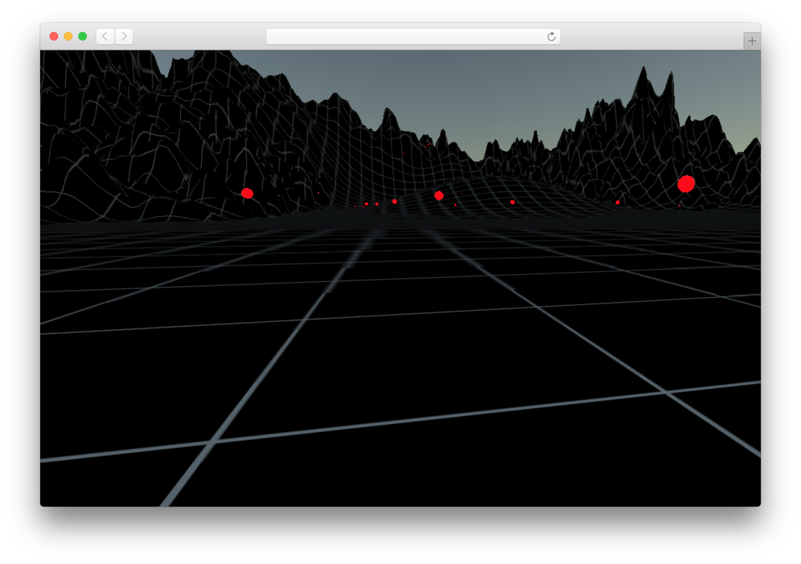

# Unity WebGL basic multiplayer demo using WebSockets

The project is a basic working example demonstrating the possibility to exchange multiply players positions using websockets. Under the hood it uses slightly modified websockets plugin and small node.js server.

Main code can be found at [`node/app.js`](node/app.js) (node.js server), [`unity/Assets/Multiplayer.cs`](unity/Assets/Multiplayer.cs) (Unity C# script) and [`unity/Assets/Plugins`](unity/Assets/Plugins) (modified plugin).

### Running

1. Start node.js server from the `node` directory: `npm i && npm start`
2. Open `unity` folder as Unity project and run the game `CMD+P`

### Credits

- [Web Sockets Plugin](https://www.assetstore.unity3d.com/en/#!/content/38367) by Unity Technologies
